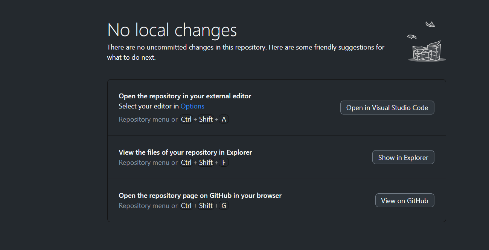

# To-Do List App

## Overview
This is a simple To-Do List application built using Flutter. The app allows users to create, view, and manage their tasks. It features location and image attachment for each task, with a clean and user-friendly interface.

## Features
- **Home Screen**: Displays a list of tasks. Shows a message when there are no tasks.
- **Add Task Screen**: Users can add new tasks, attach their current location, and select images from their gallery.
- **Task List**: Tasks are displayed in a ListView with options to mark as completed and delete.
- **Task Details Screen**: View and edit task details, including full images and map locations.
- **Task Storage**: All tasks are stored in Firebase Firestore for persistence.
- **State Management**: Utilizes the Provider package for managing application state.
- **Navigation**: Easy navigation between screens using Flutter's bottom navigation.
- **Floating Action Button (FAB)**: Quick access to add new tasks.
- **Clean UI Design**: Simple, consistent color scheme with proper spacing.

## Technologies Used
- **Flutter**: Framework for building the mobile application.
- **Firebase**: Backend services for data storage (Firestore).
- **Provider**: State management solution.

## Installation
1. **Clone the repository**:
   ```bash
   git clone https://github.com/yourusername/todo_list_app.git
   cd todo_list_app
   ```
2. **Install dependencies**:
    flutter pug get
3. **Must set Google Map API key**:
    inside `android/app/src/main/AndroidManifest.xml`
    inside application section please your API key.
    Also add for IOS and web followe `pub.dev` search google maps flutter.

